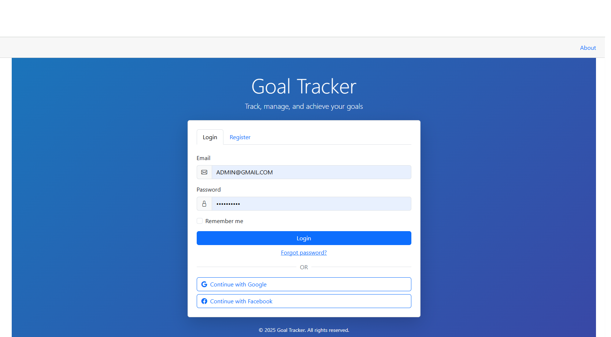
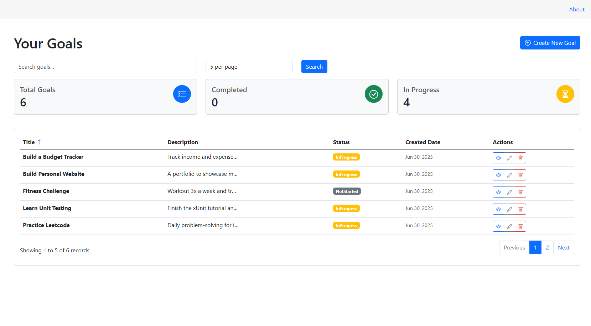
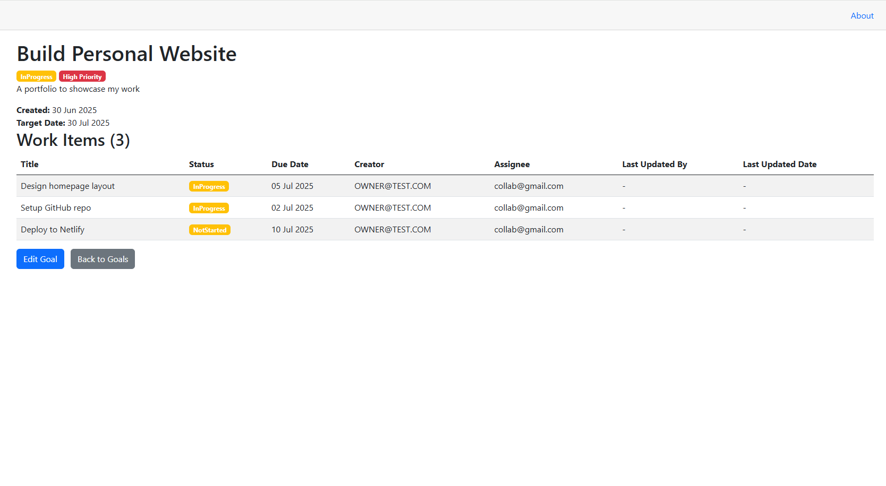
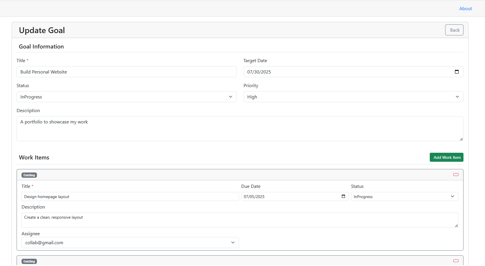

# 🎯 GoalTracker

A full-stack goal management system built with Blazor WebAssembly, ASP.NET Core, and Entity Framework Core. The app allows users to create, track, and categorize personal goals, each with its own list of nested work items (subtasks), to stay productive and accountable.

---

## 🌟 Features

✅ Clean Architecture (Domain-Driven Design)  
✅ Layered project structure (API, Application, Domain, Infrastructure, UI)  
✅ Full CRUD for Goals  
✅ Nested Work Items: Each goal contains multiple subtasks  
✅ Full CRUD for both Goals and Work Items  
✅ Goal Categorization  
✅ Pagination for efficient data loading  
✅ User Authentication (Register / Login)  
✅ Authorization Policies (Role-based / Claims)  
✅ Entity Framework Core with SQL Server  
✅ Blazor WebAssembly frontend  
✅ Unit tests for all layers (one per project, expanding soon)

---

## 🌟 Authentication & Security

- Secure user authentication using **ASP.NET Core Identity**  
- **Role-based authorization policies** to restrict access to protected actions/pages  
- API calls use **JWT tokens** for authenticated sessions  


---
## 🌟 Unit Testing
Basic unit tests included for:
Domain
Application
Infrastructure
API
✅ Currently: One test per project
- Upcoming: Full coverage after completing unit testing tutorials

---
## 🌟 Architecture Notes
Uses a one-to-many relationship between Goal and WorkItem
Clean separation of concerns via:
✅Domain: Models & interfaces
✅Application: Business logic & services
✅Infrastructure: Data access (EF Core)
✅API: Web endpoints
✅Blazor.UI: Frontend UI
Easily extendable to support:
-Status, deadlines, reminders
-User-specific data
-Custom roles and permissions

---

## 🌟 Tech Stack

- **Backend**: ASP.NET Core Web API (C#)
- **Frontend**: Blazor WebAssembly
- **Database**: Entity Framework Core + SQL Server
- **Architecture**: Clean Architecture with Domain-Driven Design
- **Testing**: xUnit for unit tests
- **Version Control**: Git + GitHub  
- *(CI/CD & deployment in progress)*

---

## 🌟 Roadmap
✅ Setup clean architecture
✅ Implement CRUD for Goals
✅Implement nested Work Items
✅Add goal categorization
✅ Setup EF Core + SQL Server
✅Add pagination
✅Add user authentication
✅ Add role-based authorization
✅Add one unit test per project
- Improve frontend UI/UX (Blazor)
- Add authentication UI polish
- Expand unit + integration tests
- Host live version on Azure or GitHub Pages
---
## 🌟 UI Preview

### GoalsTracker Login 

### Goals List with Pagination

### Goals Details with WorkItems

### Goal and WorkItems Edit

## 🌟 How to Run Locally

1. **Clone the repository**
   ```bash
   git clone https://github.com/shimaHp/GoalTracker.git
   
## 🌟 Contact
Author: Shima Hosseini
🔗 GitHub: @shimaHp
E-mail:Shimahp0@gmail.com

This is a portfolio project developed after graduating with distinction in Advanced Computer Science. I’m currently seeking software development roles and always open to feedback, contributions, or mentorship.
